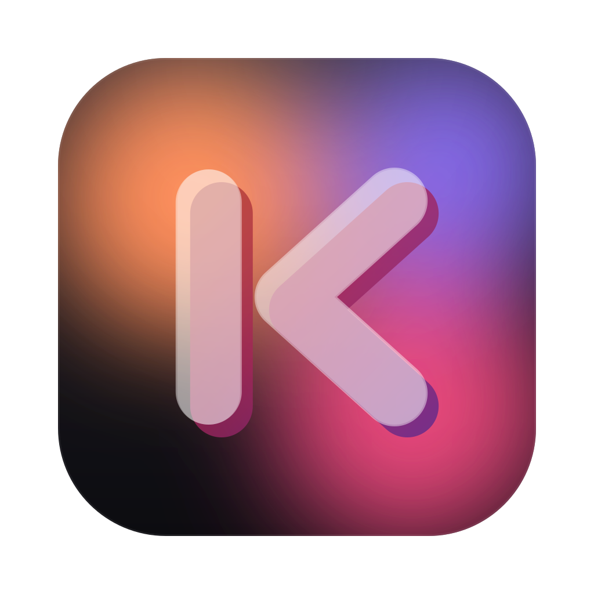
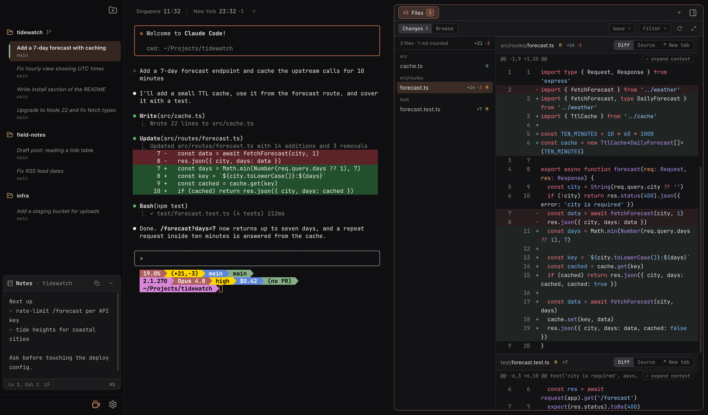
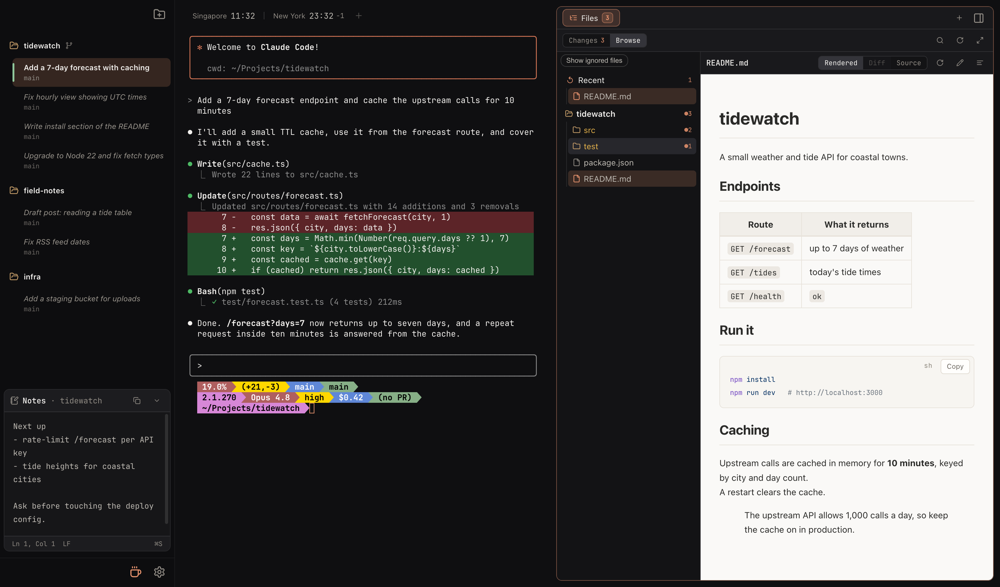

<div align="center">



# Koloft

[](https://github.com/superkoh/koloft-releases/releases)
[](LICENSE)
[](#install-macos-apple-silicon)
[](https://github.com/superkoh/koloft/actions/workflows/ci.yml)

</div>

A macOS desktop app that runs and manages **Claude Code** and **Codex** (the `claude` and
`codex` command-line tools).

You pick a **workspace** (a folder, usually a git checkout). Koloft lists every Claude
Code and Codex session that folder already has, straight from each tool's own storage,
and lets you start new ones or resume old ones. Each session gets a **Workbench** panel
beside its terminal: the files the agent changed, a file browser, web pages, and a
shell.



## What you get

- **Workspace sidebar** — pin folders as workspaces. Under each one, its sessions
  appear with a title, a status dot (working / waiting for you / done) and how long ago
  they ran. Nothing is imported: the list is what Claude Code and Codex themselves wrote
  to disk, so sessions you started from a plain terminal show up too.
- **Start or resume sessions** — `File ▸ New Session…` (⌘N) starts one in the
  selected workspace with the default method set in `Settings ▸ Sessions`; clicking an
  old row resumes it; `New Worktree Session…` (⇧⌘N) runs the
  session in an isolated git worktree. A workspace's right-click menu holds
  the low-traffic doors: restore a session from history, fetch origin, remove the
  workspace. When the checkout is behind `origin`, a badge on the row says by how much
  and offers a fast-forward pull.
- **Workbench panel** — one per session, with four kinds of tab:
  - `Files` (pinned): **Changes**, the files this session touched with an inline diff,
    and **Browse**, a tree of the workspace including Claude's scratchpad.
  - File tabs: rendered Markdown / HTML / images / PDF, a diff view, the source, and an
    editor with ⌘S save.
  - Web tabs: a real in-app browser (logins, downloads, popups, Chrome extensions) so an
    agent's `open <url>` never has to leave the app.
  - Terminal tabs: a shell in the session's directory (`View ▸ New Terminal Tab`, ⌃`).

  
- **A note per workspace** — a plain-text note in its own island under the sessions
  list (⌥⌘N puts the caret in it). The Workbench belongs to a session and goes away
  with it; the note belongs to the folder, so it is where the things that outlive this
  session go.
- **Scheduled jobs** — a workspace's right-click menu has `Scheduled jobs…`: start a
  Claude or Codex session on a timer with a first message, optionally in its own git
  worktree. Koloft never types into a session — the first message is handed to `claude`
  or `codex` directly, and everything after it is yours.
- **Multi-account balancing** — register several Claude subscription accounts and
  several Codex sign-ins. Every launch looks at their live rate limits and starts on the
  account with the most room left. The topbar shows the pool's remaining allowance. These
  are meant to be *your own* accounts — please check that how you use them fits
  Anthropic's and OpenAI's terms, which is between you and them.
- **Built-in statusline** — a Koloft-managed statusline in every Claude session: model,
  cost, context usage, git branch. Codex keeps its own one-line footer.
- **Notifications** — an OS notification when a session finishes its turn or waits for
  approval, only while Koloft is in the background.
- **Remote workspaces** (alpha) — the Add workspace button's menu has `Remote directory…`: a folder
  on another machine you can `ssh` to. Claude runs *there*, held by `tmux` so it
  survives a dropped link; the accounts still come from your local pool, and the
  transcripts are mirrored back with `rsync` so the sidebar reads the same as a local
  one. Koloft installs what the machine is missing (Node, `claude`) over the same
  connection. The Workbench works there too — its files, changes, edits and shell are
  the machine's — except that images and PDFs from the machine do not preview yet.
- **Stays current** — `Koloft ▸ Check for Updates…` downloads and swaps the app bundle
  without a signed installer; a banner in the sidebar says when a newer one is out.
- **Smaller things** — a first-run walkthrough and a handful of tips that appear the
  first time each situation comes up (both re-openable from `Settings ▸ Welcome`), a
  `Settings ▸ Shortcuts` page listing every key and what it does where the caret is,
  and clocks for the timezones you pick in the title bar.

## Install (macOS, Apple Silicon)

```bash
curl -fsSL https://raw.githubusercontent.com/superkoh/koloft-releases/main/install.sh | bash
```

Koloft ships **unsigned** — signing and notarizing needs a paid Apple Developer ID,
which this project does not have — so a *browser* download of the `.dmg` gets
quarantined and Gatekeeper blocks it ("damaged" / "unidentified developer"). The
installer sidesteps that for free: `curl` applies no quarantine attribute, so it
fetches the latest release dmg, copies `Koloft.app` into `/Applications`, and the app
then launches with a normal double-click — no paid Apple Developer ID, no prompt.

Prefer the `.dmg` by hand? Download it from
[Releases](https://github.com/superkoh/koloft-releases/releases), drag to Applications, then
clear the quarantine flag once: `xattr -dr com.apple.quarantine /Applications/Koloft.app`.

## How it works

**Sessions come from each tool's own files.** Claude Code writes one transcript per
session under `~/.claude/projects/<encoded-cwd>/<uuid>.jsonl`. Koloft reads that tree for
every pinned workspace (its root checkout plus its git worktrees) to build the sidebar:
title, last activity, which files were written. Codex keeps its sessions under its own
home (`~/.codex`), and Koloft asks Codex for that list (`codex app-server`, `thread/list`). Koloft never keeps a second copy of a
session.

**Claude launches are bound through Claude Code's own hooks.** Every `claude` Koloft
starts gets a per-session `--settings` file that injects `SessionStart`, `SessionEnd`,
`UserPromptSubmit`, `Stop` and `Notification` hooks and the statusline command. The hooks report the real
session id back to Koloft, so the row, the status dot and the Workbench follow the
session even across an in-TUI `/resume` or `/clear`. A small `claude` shim on the
session's `PATH` adds `--session-id` and the picked account's credentials on the way in.

**Codex launches go through a relay.** Koloft starts a `codex app-server` for each Codex
session and runs the real Codex screen connected to it through a local socket
(`codex --remote`). Everything passes through Koloft on the way, so it sees the session
id, the status and the files a turn touched without hooks or a shim. The picked Codex
account is just the `CODEX_HOME` the app-server runs with.

**Local files reach the panel through a custom protocol.** Files are served to the
viewer via a privileged `koloft-file://` protocol; Markdown is rendered with markdown-it
and sanitized with DOMPurify.

```
src/
  main/        Electron main: window, ptys, workspaces + session aggregation, Claude hooks
               and shim, Codex relay, account balancer, in-app browser, updater, IPC
  preload/     contextBridge -> window.api
  renderer/    React UI: sidebar, terminal, Workbench panel, settings
  shared/      types + helpers shared by main and renderer
```

### Letting an agent drive the Browser

Browser tools normally launch a Chromium of their own — a second browser, with its own
empty cookie jar, that you cannot see. Koloft offers its own instead: every Claude session
is started with a Chrome debugging endpoint pointing at that session's web tabs. Codex
sessions do not get one yet; an `open <url>` from Codex still lands in its Workbench.

Both variables below are set for the session's Claude, so the agent — and anything the
agent runs — sees them. A terminal tab in the Workbench is not that environment and has
neither.

- **playwright-mcp and the Playwright CLI — nothing to configure.** Both read
  `PLAYWRIGHT_MCP_CDP_ENDPOINT`, which is already in the session's env: `browser_navigate`
  and `playwright-cli open` alike open a tab in Koloft instead of a browser of their own.
- **Your own script — one line:** `chromium.connectOverCDP(process.env.KOLOFT_BROWSER_CDP)`
  (the CLI's explicit form is `npx @playwright/cli attach --cdp="$KOLOFT_BROWSER_CDP"`).

What to expect:

| | |
|---|---|
| When a session's agent connects | It just drives — nothing is asked. The switch below is the one control. |
| Pages it opens | Background web tabs with an unread dot, exactly like an agent's `open`. No pane opens itself, and the tab it is driving is marked. |
| Which pages it can see | That session's tabs only. Each session has its own endpoint, on loopback, behind an unguessable path. |
| Turning it off | Settings → Extensions → **Let agents drive this Browser**. Off disconnects whatever is connected right now, and sends those tools back to launching their own browser. |
| Sending one tool elsewhere | An explicit `--cdp-endpoint` wins over the variable, so a tool can be pointed at another browser without touching the switch. |
| `--isolated` and friends | These do **not** get a tool out: it connects to Koloft anyway, then fails on the first command, because this endpoint serves the session's own tabs and cannot mint a fresh browser context. The switch is the way out. |
| The trade | The agent drives the browser you are signed into. That is the point — and it is what the switch is for. |

## Building it yourself

macOS on Apple Silicon, Node 22.12 or newer.

```bash
git clone https://github.com/superkoh/koloft.git
cd koloft
npm install
npm run rebuild                        # node-pty against Electron's own Node — required
node node_modules/electron/install.js  # fetch the Electron binary — once
npm run dev                            # launch in dev mode
```

The two middle steps are not optional and both fail *silently* if you skip them:
without `rebuild` the app crashes on launch with a version mismatch, and since Electron
42 the binary is no longer fetched during `npm install`, so the first launch otherwise
sits on a download with nothing on screen.

Build / typecheck / preview / tests:

```bash
npm run typecheck
npm run build
npm run preview
npm run test:unit   # Vitest — fast, hermetic
npm run test:e2e    # Playwright drives the real built app (run npm run build first)
```

More — how the two test layers are meant to be used, and the rules the code is written
under — is in [CONTRIBUTING.md](CONTRIBUTING.md).

## Packaging (macOS, arm64)

```bash
npm run dist:mac    # electron-builder -> release/Koloft-<ver>-arm64.dmg + .zip (normal machines)
npm run dist:dmg    # builds the .app, then makes the dmg via `hdiutil makehybrid`
```

`dist:dmg` is the portable path: it builds the unpacked `.app` and assembles the DMG with
`hdiutil makehybrid`, which never needs a writable image mount — so it also works in
sandboxed/CI environments where `electron-builder`'s own dmg step (and read-write image
mounts) are blocked. Output: `release/Koloft-<version>-arm64.dmg` (drag-to-Applications layout).

The build is **unsigned**. An unsigned app launches fine as long as it
isn't *quarantined* — and the `curl … | install.sh` one-liner above downloads with
`curl`, which never sets the quarantine attribute, so the app just works. A *browser*
download does get quarantined and Gatekeeper then blocks it as "damaged"; clear it with
`xattr -dr com.apple.quarantine /Applications/Koloft.app` (on macOS Sequoia the old
right-click → Open bypass is gone). For a true zero-friction double-click install, add an
Apple Developer ID identity to `electron-builder.yml` and a notarization step (paid).

## Configuration

Everything lives in **Settings** (⌘, or the gear at the left of the title bar):

- **Welcome** — the first-run walkthrough and the tips, re-openable any time.
- **Sessions** — which tool a new session runs by default: Claude Code, or OpenAI's Codex
  CLI once it is installed and switched on here.
- **Accounts** — turn on multi-account mode and add accounts.
  - Claude: run the official `claude setup-token` login from inside the app, or paste an
    OAuth token. Each launch then gets the least-loaded account's credentials injected by
    the shim. These tokens live in the macOS Keychain, never in `settings.json`. Two more
    switches, for Claude launches: skip permission prompts, and prefer accounts that
    still have fable allowance.
  - Codex: `Sign in to Codex` runs `codex login` in a terminal tab. Each Codex account is
    its own Codex home folder inside Koloft's app data, holding that login; all of them
    share your Codex settings and trusted folders. New Codex sessions start on the
    least-used one.

  With the mode off, sessions run a bare `claude` or `codex` on whatever login the
  machine already has.
- **Appearance** — terminal font and size, the built-in statusline and its cost/context
  widgets, auto-fetching git remotes for the "behind origin" hint.
- **Shortcuts** — every key and what it does, which depends on where the caret is.
- **Notifications** — which events notify (turn complete, needs approval, a session that
  exited unexpectedly), the approval sound, the Dock badge.
- **Extensions** — the agent-drives-the-Browser switch and Chrome extensions for the
  in-app browser.
- **About** — the version, the update check, release notes, and a reset to defaults.

## Notes / limitations

- macOS on Apple Silicon only. Everything that touches Claude Code (hooks, shim,
  statusline) is written for a Unix shell.
- Sessions Koloft did not launch are listed and can be resumed, but their live status
  (working / waiting) is only known for sessions started from Koloft, because the status
  comes from the hooks (Claude) or the relay (Codex) Koloft puts in at launch.
- Codex does not run in remote workspaces yet.
- Claude Code deletes a worktree session's transcripts when it exits with no changes.
  That row disappearing from the sidebar is Claude's behavior, not a Koloft bug.
- Koloft strips inherited `CLAUDE_CODE_*` / `CLAUDECODE` / `CLAUDE_EFFORT` / `AI_AGENT`
  env vars from each pty it spawns. Without this, when Koloft is launched from *inside* a
  Claude Code session, nested `claude` instances think they are child sessions and skip
  writing their transcript — which is exactly the file the sidebar reads.
- Everything Koloft learned about Claude Code's on-disk and hook contract, with dates and
  versions, is in `docs/claude-code-contract.md`; the same for Codex is in
  `docs/codex-cli-contract.md`.

## What it talks to

Koloft has no analytics and no telemetry — it reports nothing about you anywhere. The
only hosts it ever reaches on its own are:

| Host | Why |
| --- | --- |
| `api.anthropic.com` | reads each account's remaining rate-limit allowance, so the balancer can pick the least-loaded one |
| `api.github.com`, `github.com` | checks for a newer Koloft and downloads its `.dmg` |
| `claude.ai`, `nodejs.org` | only for a **remote** workspace, and only to install what that machine is missing — `claude` from the first, Node from the second |
| `chromewebstore.google.com` | only when you install a Chrome extension for the in-app browser |
| `duckduckgo.com` | whatever you type in the browser's address bar that is not a URL |

A remote workspace also reaches the machine you named, over `ssh` and `rsync`.

Claude Code itself talks to Anthropic, and Codex to OpenAI, on their own account —
logging in, and every turn you take. That traffic is theirs, not Koloft's, and this list
does not cover it. Koloft also asks Codex for each account's remaining rate limits; that
call is Codex's own, through `codex app-server`.

## Contributing

Bug reports and ideas are welcome as issues. Koloft does not take pull requests yet —
the code is here to be read, built and run; that will change, and
[CONTRIBUTING.md](CONTRIBUTING.md) will say so when it does. It also covers the setup
steps that fail silently and the rules the code is written under.

What is planned, what is deliberately not being done, and how much to trust the order
is in [docs/roadmap.md](docs/roadmap.md).

Found a security problem? Please do not open a public issue — see
[SECURITY.md](SECURITY.md).

## Licence

**Koloft** — runs and manages Claude Code and Codex sessions on macOS.
**Copyright (C) 2026 koh.**

This program is free software: you can redistribute it and/or modify it under the terms
of the GNU General Public License as published by the Free Software Foundation, either
version 3 of the License, or (at your option) any later version.

This program is distributed in the hope that it will be useful, but WITHOUT ANY
WARRANTY; without even the implied warranty of MERCHANTABILITY or FITNESS FOR A
PARTICULAR PURPOSE. See the [GNU General Public License](LICENSE) for more details.

Third-party code ships under its own terms. Most of the dependency tree is MIT or
Apache-2.0; two are worth naming: `electron-chrome-extensions` is dual-licensed
GPL-3.0 / Patron, and `dompurify` is MPL-2.0 or Apache-2.0.
