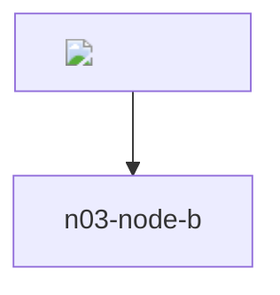

# N03 in-document security downgrade

```mermaid
%%{init: {"securityLevel": "loose", "flowchart": {"htmlLabels": true}}}%%
flowchart TD
  A["<img src='nfr-n03-missing.png' onerror='window.__koloftN03Pwn = 1'>"] --> B["n03-node-b"]
```

nfr-n03-body-visible
