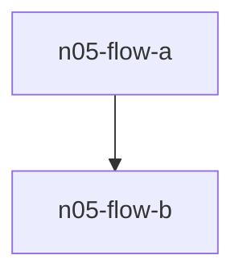
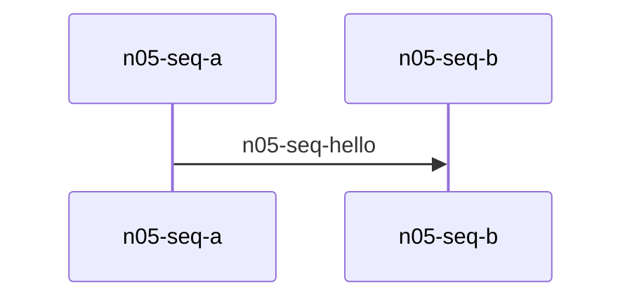
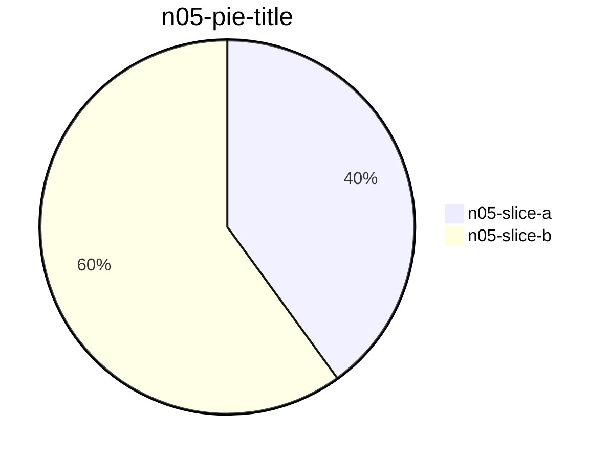

# N05 three diagrams, two formulas, three code blocks

nfr-n05-opening-line



```bash
echo n05-first-code-block
```

Inline formula: $E = mc^2$ stays inline.



```ts
export const n05 = { second: true }
```

$$\frac{n05}{block}$$



```python
print("n05-third-code-block")
```

nfr-n05-closing-line
