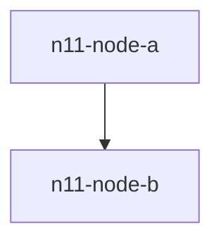

# n11-heading-one

n11 filler paragraph 01
n11 filler paragraph 02

n11 filler paragraph 03

n11 filler paragraph 04

n11 filler paragraph 05

n11 filler paragraph 06

n11 filler paragraph 07

n11 filler paragraph 08

n11 filler paragraph 09

n11 filler paragraph 10

## n11-heading-two

n11 filler paragraph 11

n11 filler paragraph 12

n11 filler paragraph 13

n11 filler paragraph 14

n11 filler paragraph 15

n11 filler paragraph 16

n11 filler paragraph 17

n11 filler paragraph 18

n11 filler paragraph 19

n11 filler paragraph 20

n11 filler paragraph 21

n11 filler paragraph 22

n11 filler paragraph 23

n11 filler paragraph 24

n11 filler paragraph 25

n11 filler paragraph 26

n11 filler paragraph 27

n11 filler paragraph 28

n11 filler paragraph 29

n11 filler paragraph 30

n11 filler paragraph 31

n11 filler paragraph 32

n11 filler paragraph 33

n11 filler paragraph 34

n11 filler paragraph 35

n11 filler paragraph 36

n11 filler paragraph 37

n11 filler paragraph 38

n11 filler paragraph 39

n11 filler paragraph 40

## n11-heading-three

n11-heading-three-body

n11 filler paragraph 41

n11 filler paragraph 42

n11 filler paragraph 43

n11 filler paragraph 44

n11 filler paragraph 45
